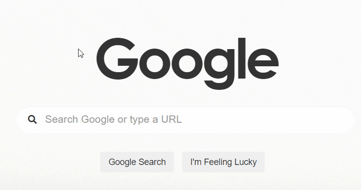

# Google-Clone
A front-end clone of Google Search including Image and Advanced Search made from scratch using HTML &amp; CSS.

## Design and Functionality

This mini-project was made to match the aesthetics of Google Search, Image Search and Advanced search as closely as possible. To make things a little more interesting, the pages were designed to have a Monochrome look/theme.

The core-functionalities are achieved by redirecting to Google's original Search, Using the name attribute within HTML to convert queries into GET parameters included in the Google Search URL.

1. Visit - [LINK](https://ishanjain18.github.io/google-clone/index.html)
2. Use just as you would with normal google search.

## Motivation

This mini-project was made as a part of [CS50 WEB](https://cs50.harvard.edu/web/2020/#:~:text=CS50%E2%80%99s%20Web%20Programming%20with%20Python%20and%20JavaScript) in order to gain a better understanding of HTML and CSS elements.

## Highlights

